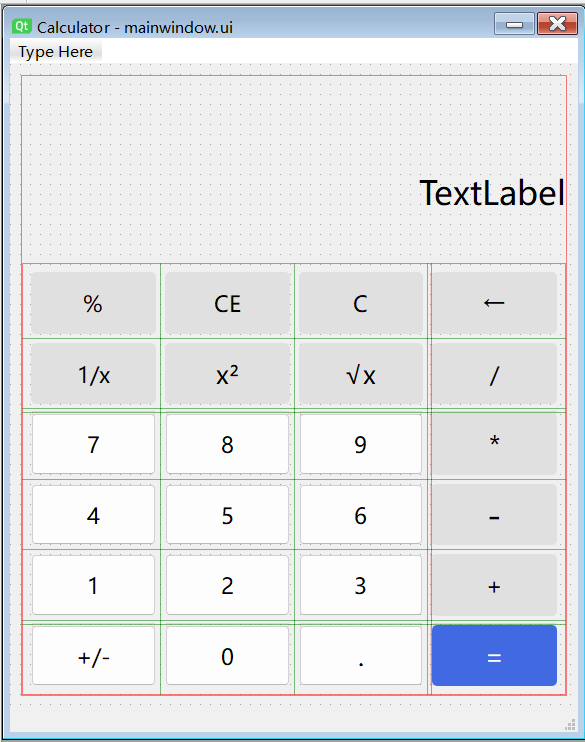
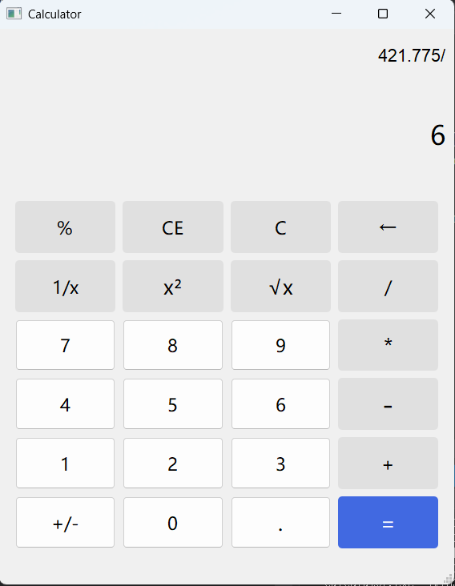

# cmake
## 介绍
CMake 是一个跨平台的构建系统生成工具。它使用平台无关的 CMake 清单文件CMakeLists.txt，指定工程的构建过程；源码树的每个路径下都有这个文件。CMake 产生一个适用于具体平台的构建系统,用户使用这个系统构建自己的工程。  
cmake是一个管理软件build过程的工具，它并不会直接build出软件可执行文件本身，而是制作出可以build出软件本身的全部工程文件，比如makefiles、msvc的工程文件，然后我们可以通过执行这些工程文件，完成最终的编译。
## 构建
1。编写CMakeLists.txt：在项目目录中创建并编写cmake的脚本文件CMakeLists.txt
2.生成平台相关的工程文件，命令形式如下：
    cmake -S <source_dir> -B <build_dir> -G <generator>   ...... 
说明:
• -S   source_dir   项目源代码目录的路径
• -B   build_dir     指定构建系统的输出目录
• -G   <generator>   指定了生成的构建系统文件的生成器
        ▪ "Unix Makefiles" 生成 Makefile
        ▪ "Visual Studio 16 2019" 生成 Visual Studio 项目
```cpp
#创建build文件夹，构建的文件存在里面
mkdir build
cd build
call "C:\Program Files (x86)\Microsoft Visual Studio\2019\Professional\VC\Auxiliary\Build\vcvarsamd64_x86.bat"
cmake -G "Visual Studio 16 2019" -A x64 ../KDevelop-Training
for %%i in (*.sln) do msbuild /m "%%i" /p:Platform=x64 /p:Configuration=Debug
cd ../
```
## 整体思路;
主窗口MainWindow类负责与页面文件进行交互，收集按键消息通过信号槽传递给calculate完成计算，calculate计算完成后再将结果通过信号槽传回MainWindow执行展示，不需要运算的操作如小数点z直接由MainWindow进行展示。 
## 界面设计：

用网格加垂直布局组合实现页面缩放时候保证控件正确显示，设置垂直布局控件比例为1:3:10保证各个空间界面大小合理
## 类的设计思路  
### Calculate类（计算）
```cpp
成员变量  
double m_firstCalNum：//存储第一个操作数  
Operation m_NextOp：//记录待执行的运算符 
enum Operation { None,Add,Subtract,Multiply,Divide,Percent,Square,Reciprocal,Sqrt,NumInverse}; //运算类型，根据输入运算符匹配执行函数  
核心函数
setFirstCalNum(double firstCalNum)：//接收并存储第一操作数  
setOperation(Operation::op)：//设置当前运算符  
double calculate(double secondCalNum)：//执行四则运算这类需要两个操作数的计算，给出resultUpdate（）信号 
percent(), square()... //执行各种函数运，抛出resultUpdate（）信号 
reset()：清空状态为初始  
信号  
resultUpdate(double result)：//任何运算完成后，都用此信号将结果推送给MainWindow,展示出来
信号连接:
connect(&m_calculate, &Calculate::resultUpdate, this, &MainWindow::onResultUpdate);
```

### MainWindow类（交互）
```cpp
成员变量
QString m_currentInput：//记录当前输入字符串
bool m_opStatus = true：//true的时候是输出就绪，false的时候是运算未完成
Calculate m_calculate：//完成计算
槽函数
onNumberClicked()//数字按钮槽函数
onOperatorClicked(Operation::op)：//将当前值提交给 Calculate 并切换运算符
onEqualClicked()：//触发calculate
onPercentClicked(), onSquareClicked()...//调用四则运算外的函数计算
onClearClicked(), onClearCEClicked(), onBackClicked()：//功能按钮
onResultUpdate(double result)：//接收结果并更新
信号连接：
所有按钮统一在 InitConnections() 中通过 connect() 绑定到对应槽
如：
connect(ui->m_btnAdd, &QPushButton::clicked, [this] { onOperatorClicked(Calculate::Add); });
connect(ui->m_btnReasult, &QPushButton::clicked, this, &MainWindow::onEqualClicked);
```
## 运行效果

